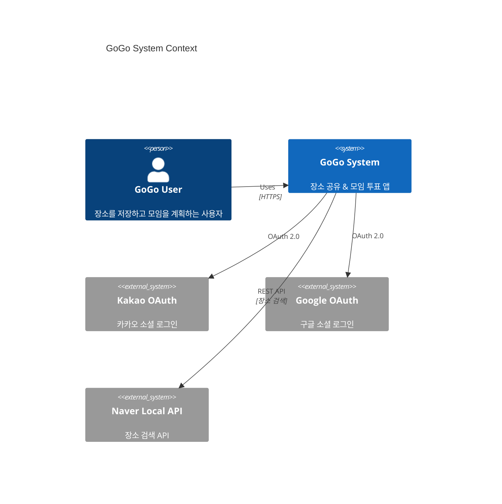
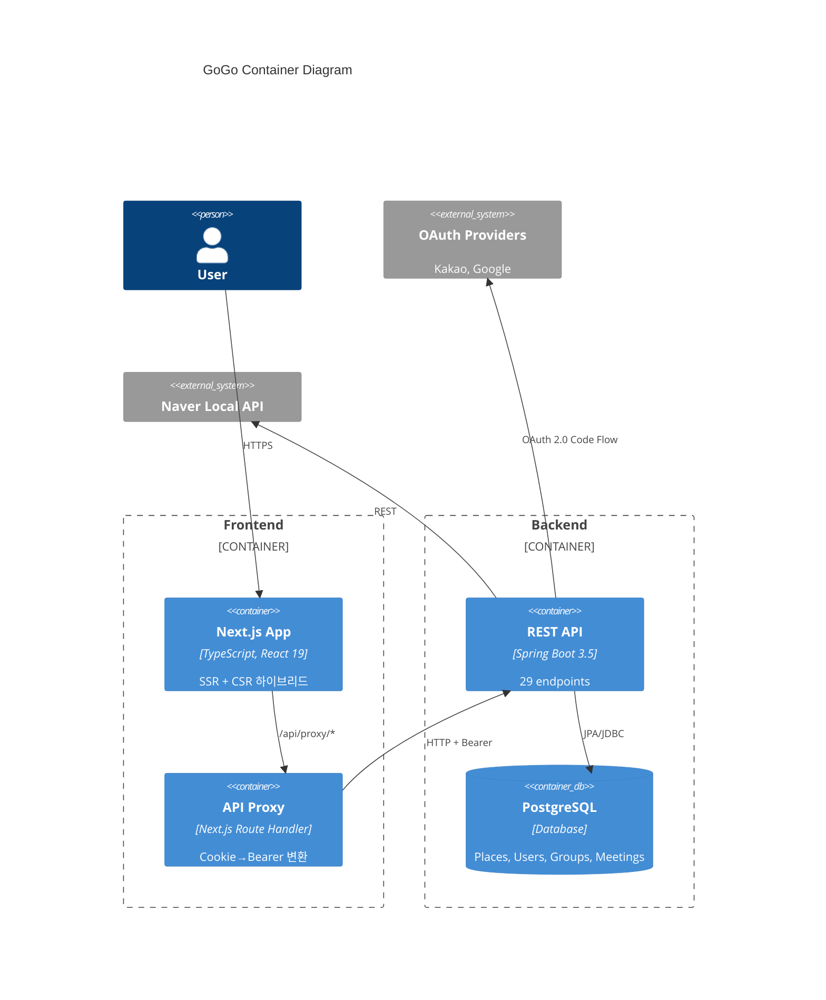
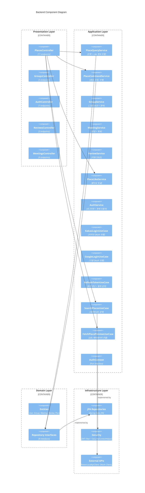
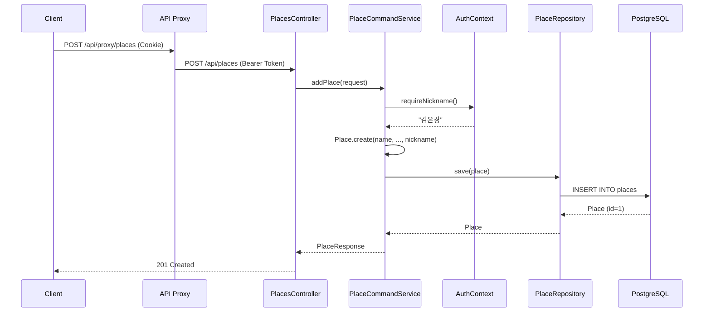
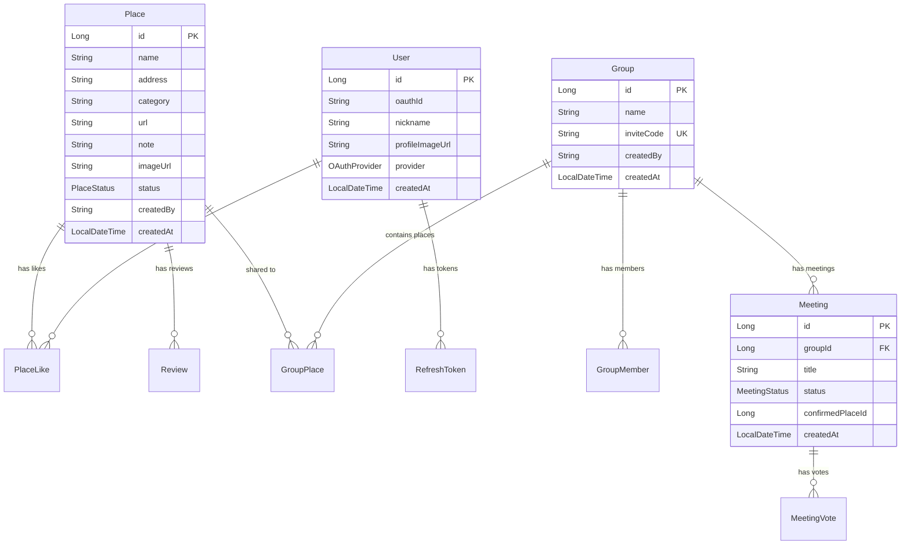
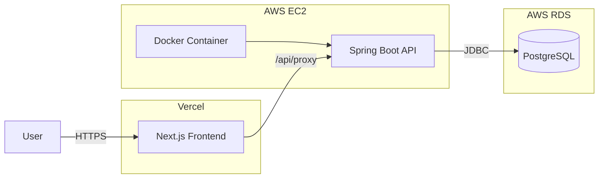

# GoGo Project Architecture Blueprint

> Generated: 2026-03-22 | Skill: architecture-blueprint-generator v1.0
> Project: GoGo — 장소 공유 & 모임 투표 앱

---

## 1. Architecture Detection & Analysis

### Technology Stack

| Layer | Technology | Version |
|-------|-----------|---------|
| **Backend Runtime** | Java | 21 (LTS) |
| **Backend Framework** | Spring Boot | 3.5.0 |
| **ORM** | Hibernate (JPA) | Spring Boot managed |
| **Database** | PostgreSQL | Production |
| **Test Database** | H2 (PostgreSQL mode) | Test only |
| **Auth** | JWT (jjwt 0.12.6) + OAuth 2.0 | HS256 |
| **API Docs** | SpringDoc OpenAPI | 2.8.3 |
| **HTML Parser** | Jsoup | 1.18.1 |
| **Frontend Framework** | Next.js (App Router) | 16 |
| **UI Library** | React | 19 |
| **Language** | TypeScript | — |
| **CSS** | Tailwind CSS | 4 |
| **Package Manager** | pnpm | — |

### Detected Architectural Pattern

**Hybrid Clean/Layered Architecture** with:
- 4-layer separation (Presentation → Application → Domain → Infrastructure)
- Port & Adapter pattern (AuthContext)
- CQRS-lite (PlaceQueryService / PlaceCommandService 분리)
- Service + UseCase 하이브리드 (CRUD는 Service, 복잡한 흐름은 UseCase)

---

## 2. Architectural Overview

### Guiding Principles

1. **Dependency Inversion** — Domain layer는 외부 의존성 없음. Repository는 인터페이스로 정의되고 Infrastructure에서 구현
2. **SecurityContext as Source of Truth** — 사용자 신원은 JWT에서만 추출. DTO에 userId/nickname 없음
3. **Static Factory Methods** — Entity 생성은 `create()`, 복원은 `reconstruct()` 팩토리 메서드 사용
4. **STATELESS** — 세션 없음. 모든 인증은 JWT Bearer 토큰 기반

### Architectural Boundaries

```
┌─────────────────────────────────────────────────────────┐
│ Frontend (Next.js on Vercel)                            │
│   ├── Client Components → /api/proxy/* (Next.js)       │
│   └── Server Components → EC2 직접 호출                  │
├─────────────────────────────────────────────────────────┤
│ API Proxy Layer (Next.js Route Handler)                 │
│   └── Cookie → Bearer Header 변환                       │
├─────────────────────────────────────────────────────────┤
│ Backend (Spring Boot on EC2/Docker)                     │
│   ├── Presentation  (REST Controllers)                  │
│   ├── Application   (Services + UseCases + DTOs)        │
│   ├── Domain        (Entities + Repository Interfaces)  │
│   └── Infrastructure (JPA, Security, External APIs)     │
└─────────────────────────────────────────────────────────┘
```

---

## 3. Architecture Visualization

### 3.1 C4 Context Diagram



### 3.2 C4 Container Diagram



### 3.3 C4 Component Diagram (Backend)



### 3.4 Data Flow: Place 생성



---

## 4. Core Architectural Components

### 4.1 Presentation Layer

| Component | File | Endpoints | Responsibility |
|-----------|------|-----------|----------------|
| PlacesController | `presentation/api/PlacesController.java` | 11 | Place CRUD + Search + Like + Preview |
| GroupsController | `presentation/api/GroupsController.java` | 5 | Group CRUD + 참여 + 장소공유 |
| AuthController | `presentation/api/AuthController.java` | 7 | OAuth + JWT Refresh + Logout |
| ReviewsController | `presentation/api/ReviewsController.java` | 2 | Review CRUD |
| MeetingsController | `presentation/api/MeetingsController.java` | 4 | Meeting + Vote + Finalize |
| HealthController | `presentation/api/HealthController.java` | 1 | Health check |

**Design Pattern**: Thin Controller — Controller는 요청 바인딩과 HTTP 상태 코드만 처리. 비즈니스 로직은 Service/UseCase에 위임.

### 4.2 Application Layer

#### Services (재사용 가능한 도메인 로직)

| Service | Purpose | Key Methods |
|---------|---------|-------------|
| PlaceQueryService | 장소 조회 + Like 정보 조합 | `getPlace()`, `getPlaces()`, `getPopularPlaces()`, `getRecent()` |
| PlaceCommandService | 장소 상태 변경 | `addPlace()`, `markVisited()`, `deletePlace()` |
| GroupService | 그룹 생명주기 | `createGroup()`, `joinGroup()`, `getGroup()`, `sharePlaceToGroup()` |
| MeetingService | 모임 투표 | `createMeeting()`, `vote()`, `finalize()`, `getMeetingResult()` |
| ReviewService | 리뷰 관리 | `addReview()`, `getReviews()` |
| PlaceLikeService | 좋아요 토글 | `like()`, `unlike()` |
| AuthService | 인증 보조 | `logout()`, `getCurrentUser()` |

#### UseCases (독립적 워크플로우)

| UseCase | Complexity | Purpose |
|---------|-----------|---------|
| KakaoLoginUseCase | High | OAuth Code → Token Exchange → User Upsert → JWT 발급 |
| GoogleLoginUseCase | High | 위와 동일 (Google provider) |
| RefreshTokenUseCase | High | Token Rotation + 탈취 감지 |
| FetchPlacePreviewUseCase | Medium | URL → HTML → OG Tag → 메타데이터 추출 (Jsoup) |
| SearchPlacesUseCase | Low | Naver Local API 호출 래퍼 |

**Service vs UseCase 기준**: CRUD + 도메인 로직 → Service / 외부 시스템 통합 + 복잡한 흐름 → UseCase

### 4.3 Domain Layer

**10 Entities** (enum 제외):

```
Place ──< PlaceLike (1:N)
Place ──< Review (1:N)
Place ──< GroupPlace (1:N)
User  ──< PlaceLike (1:N)
User  ──< RefreshToken (1:N)
Group ──< GroupMember (1:N, embedded)
Group ──< GroupPlace (1:N)
Group ──< Meeting (1:N)
Meeting ──< MeetingVote (1:N)
```

**Entity Design Pattern**:
- `static create()` — 새 엔티티 생성 (validation 포함)
- `static reconstruct()` — DB에서 복원 (validation 생략)
- `protected` no-arg constructor — JPA 요구사항
- Business logic in entity — `place.markAsVisited()`, `group.addMember()`

### 4.4 Infrastructure Layer (41 files)

| Sub-package | Files | Purpose |
|-------------|-------|---------|
| `persistence/` | 20 | Repository 구현 (Impl + JpaRepo) |
| `persistence/entity/` | 7 | Group/Meeting JPA 엔티티 |
| `persistence/mapper/` | 2 | Domain ↔ JPA 변환 |
| `security/` | 3 | JWT Filter, SecurityContextHelper, AuthenticatedUser |
| `config/` | 3 | SecurityConfig, CorsConfig, DataInitializer |
| `external/` | 3 | NaverLocalApiClient + DTOs |
| `filter/` | 1 | RequestLoggingFilter |

---

## 5. Architectural Layers & Dependencies

### Layer Dependency Map

```
Presentation ─────→ Application ─────→ Domain ←───── Infrastructure
                         │                                 │
                         │         implements               │
                         └─── Port (interface) ←────────────┘
```

### Dependency Rules

| From → To | Allowed? | Mechanism |
|-----------|----------|-----------|
| Presentation → Application | ✅ | Service/UseCase/DTO 주입 |
| Application → Domain | ✅ | Entity/Repository 사용 |
| Infrastructure → Domain | ✅ | Repository 구현 |
| Infrastructure → Application | ✅ | Port 구현 (AuthContext) |
| Domain → Application | ❌ | 위반 없음 |
| Domain → Infrastructure | ❌ | 위반 없음 |
| Application → Infrastructure | ⚠️ | 아래 위반 사항 참조 |

### 레이어 위반 사항

| # | 위반 | 파일 | 심각도 |
|---|------|------|--------|
| 1 | `application/auth/` 패키지에 JWT/OAuth 인프라 코드 존재 | `JwtService.java`, `KakaoOAuthClient.java`, `GoogleOAuthClient.java` | **CRITICAL** |
| 2 | `SecurityConfig`가 `application/auth/JwtService` 직접 import | `infrastructure/config/SecurityConfig.java:4` | MAJOR |
| 3 | `SearchPlacesUseCase`가 `infrastructure/external/NaverLocalApiClient` 직접 import | `application/usecase/SearchPlacesUseCase.java` | MAJOR |

---

## 6. Data Architecture

### Domain Model



### Data Access Patterns

**현재 3중 구조 (Place 예시)**:

```
PlaceRepository (domain/repository/)     ← 인터페이스 정의
    ↓ implements
PlaceRepositoryImpl (infrastructure/)    ← 위임만 하는 구현체
    ↓ delegates to
PlaceJpaRepository (infrastructure/)     ← Spring Data JPA (실제 쿼리)
```

**데이터 변환 패턴 (Group/Meeting만)**:
```
Group (domain) ←→ GroupMapper ←→ GroupJpaEntity (infrastructure)
```

**Place/User/Review/PlaceLike**: JPA 어노테이션이 도메인 엔티티에 직접 → Mapper 불필요

### 쿼리 전략

| 유형 | 구현 |
|------|------|
| 기본 CRUD | Spring Data JPA 자동 생성 |
| 카테고리 필터 | `findByCategory(String)` — 메서드 이름 쿼리 |
| 인기 장소 | Native Query (GROUP BY + COUNT + 가중치) |
| 최신 장소 | `findAllByOrderByCreatedAtDesc(Pageable)` |
| Like 존재 확인 | `existsByUserIdAndPlaceId(Long, Long)` |

---

## 7. Cross-Cutting Concerns

### 7.1 Authentication & Authorization

**Architecture**: STATELESS JWT + OAuth 2.0 Authorization Code Flow

```
OAuth Flow:
Browser → GET /api/auth/{provider}/authorize → 302 → OAuth Provider
         → callback → Backend validates code, generates JWT pair
         → 302 → Frontend /auth/callback?at=...&rt=...
         → Server Component sets HttpOnly cookies

API Flow:
Client → API Proxy (Cookie → Bearer) → JwtAuthenticationFilter → SecurityContext
```

**Security Boundaries**:
- Public: `GET /api/places/**`, `/api/auth/**`, `/api/health`, Swagger
- Authenticated: 나머지 전부
- No role-based access control (RBAC) — 현재 불필요

**Identity Resolution**:
```java
// Port (application/port/AuthContext.java)
public interface AuthContext {
    Optional<Long> currentUserId();
    Optional<String> currentNickname();
    default Long requireUserId() { ... }    // throws if unauthenticated
    default String requireNickname() { ... } // returns "anonymous" if absent
}

// Adapter (infrastructure/security/SecurityContextHelper.java)
@Component
public class SecurityContextHelper implements AuthContext { ... }
```

### 7.2 Error Handling

**현재**: 모든 비즈니스 에러가 `IllegalArgumentException`으로 통일

```java
// 현재 패턴 — 개선 필요
throw new IllegalArgumentException("장소를 찾을 수 없습니다. id=" + id);
throw new IllegalArgumentException("그룹 이름은 필수입니다.");
throw new IllegalStateException("인증 정보가 없습니다.");
```

**한계**: HTTP 상태 코드 매핑이 불명확 (404 vs 400 vs 409 구분 불가)

### 7.3 Logging & Monitoring

- `RequestLoggingFilter` — 모든 HTTP 요청 로깅
- SLF4J + Logback (Spring Boot default)
- `com.gogo: DEBUG`, `org.hibernate.SQL: DEBUG` (application.yml)
- 구조화된 로깅 미적용

### 7.4 Validation

| Layer | Strategy |
|-------|----------|
| Presentation | `@Valid` + Bean Validation (jakarta.validation) |
| Domain | `static validate()` in entity factory methods |
| Infrastructure | DB constraints (NOT NULL, UNIQUE) |

### 7.5 Configuration Management

- **Environment Variables** — 모든 시크릿 (`JWT_SECRET`, `DB_URL`, OAuth credentials)
- **application.yml** — `${ENV_VAR:default}` 패턴으로 로컬 개발 지원
- **No profiles** — 단일 application.yml, 환경변수로 분기
- **DDL** — `ddl-auto: update` (스키마 자동 진화)

---

## 8. Service Communication Patterns

### Frontend ↔ Backend

```
┌──────────────┐     /api/proxy/*     ┌────────────────┐     HTTP + Bearer    ┌────────────┐
│  Client      │ ──────────────────→  │  Next.js Route │ ─────────────────→   │  Spring    │
│  Component   │     (with Cookie)    │  Handler       │     (Cookie→Header)  │  Boot API  │
└──────────────┘                      └────────────────┘                      └────────────┘

┌──────────────┐     Direct HTTP      ┌────────────────┐
│  Server      │ ──────────────────→  │  Spring Boot   │
│  Component   │  NEXT_PUBLIC_API_URL │  API           │
└──────────────┘                      └────────────────┘
```

**API 규약**: JSON over HTTP, RESTful (resource-oriented URLs), 한국어 에러 메시지

### Backend ↔ External APIs

| External System | Protocol | Purpose | File |
|-----------------|----------|---------|------|
| Kakao OAuth | OAuth 2.0 Code Flow | 소셜 로그인 | `application/auth/KakaoOAuthClient.java` |
| Google OAuth | OAuth 2.0 Code Flow | 소셜 로그인 | `application/auth/GoogleOAuthClient.java` |
| Naver Local API | REST (GET) | 장소 검색 | `infrastructure/external/NaverLocalApiClient.java` |

---

## 9. Technology-Specific Patterns

### 9.1 Java / Spring Boot Patterns

**Dependency Injection**: Constructor injection only (Spring 추천 패턴)

```java
@Service
@Transactional(readOnly = true)
public class PlaceQueryService {
    private final PlaceRepository placeRepository;
    private final PlaceLikeRepository placeLikeRepository;
    private final AuthContext authContext;

    public PlaceQueryService(PlaceRepository placeRepository,
                             PlaceLikeRepository placeLikeRepository,
                             AuthContext authContext) {
        this.placeRepository = placeRepository;
        this.placeLikeRepository = placeLikeRepository;
        this.authContext = authContext;
    }
}
```

**Transaction Management**:
- `@Transactional(readOnly = true)` — Query services
- `@Transactional` — Command services
- Class-level 선언, 메서드 오버라이드 없음

**Security Filter Chain**: Custom JWT filter before `UsernamePasswordAuthenticationFilter`

```java
http.addFilterBefore(new JwtAuthenticationFilter(jwtService),
        UsernamePasswordAuthenticationFilter.class);
```

### 9.2 React / Next.js Patterns

**State Management**: React Context (no external library)

```
AuthContext  → 사용자 인증 상태 (user, loading, login, logout)
ThemeContext → 테마 상태 (light/dark/system)
Page State  → useState per page (places, forms, modals)
```

**API Client**: Centralized `apiFetch()` wrapper

```typescript
// lib/api/config.ts
const API_BASE = typeof window === 'undefined'
  ? process.env.NEXT_PUBLIC_API_URL   // SSR: 직접 호출
  : '/api/proxy';                     // CSR: 프록시 경유

export async function apiFetch(path, options) {
  return fetch(`${API_BASE}${path}`, { credentials: 'include', ...options });
}
```

**Rendering Strategy**: Hybrid SSR/CSR — Landing page는 SSR, 나머지는 Client Component

---

## 10. Implementation Patterns

### 10.1 Entity (Domain Model)

```java
// 패턴: Static Factory + Protected Constructor + Business Methods
@Entity
@Table(name = "places")
public class Place {
    @Id @GeneratedValue(strategy = GenerationType.IDENTITY)
    private Long id;

    // ... fields with JPA annotations

    protected Place() {}  // JPA requirement

    public static Place create(String name, ...) {
        validate(name);           // fail-fast validation
        Place place = new Place();
        place.name = name;
        place.status = PlaceStatus.WANT_TO_GO;  // default state
        place.createdAt = LocalDateTime.now();
        return place;
    }

    public void markAsVisited() {  // domain behavior
        this.status = PlaceStatus.VISITED;
    }

    private static void validate(String name) {
        if (name == null || name.isBlank())
            throw new IllegalArgumentException("장소 이름은 필수입니다.");
    }
}
```

### 10.2 Service (CQRS-lite)

```java
// Query Service: 읽기 전용, Like 정보 조합
@Service
@Transactional(readOnly = true)
public class PlaceQueryService {
    public PlaceResponse getPlace(Long id) {
        Place place = placeRepository.findById(id)
            .orElseThrow(() -> new IllegalArgumentException("장소를 찾을 수 없습니다."));
        return toResponse(place);  // domain → DTO 변환 + like count/isLiked 조합
    }
}

// Command Service: 쓰기, AuthContext에서 사용자 정보 추출
@Service
@Transactional
public class PlaceCommandService {
    public PlaceResponse addPlace(AddPlaceRequest request) {
        String nickname = authContext.requireNickname();
        Place place = Place.create(request.name(), ..., nickname);
        return PlaceResponse.from(placeRepository.save(place));
    }
}
```

### 10.3 Controller (Thin Controller)

```java
@RestController
@RequestMapping("/api/places")
public class PlacesController {
    @PostMapping
    public ResponseEntity<PlaceResponse> addPlace(@Valid @RequestBody AddPlaceRequest request) {
        return ResponseEntity.status(HttpStatus.CREATED)
            .body(placeCommandService.addPlace(request));
    }
    // Controller에 비즈니스 로직 없음 — HTTP 바인딩만
}
```

### 10.4 Repository (현재 3중 구조)

```java
// Layer 1: Domain Interface
public interface PlaceRepository {
    Place save(Place place);
    Optional<Place> findById(Long id);
    List<Place> findPopularPlaces(int limit);
}

// Layer 2: Implementation (위임만)
@Repository
public class PlaceRepositoryImpl implements PlaceRepository {
    private final PlaceJpaRepository jpa;
    @Override public Place save(Place place) { return jpa.save(place); }
    // ... 모든 메서드가 단순 위임
}

// Layer 3: Spring Data JPA
public interface PlaceJpaRepository extends JpaRepository<Place, Long> {
    @Query(nativeQuery = true, value = "SELECT ... ORDER BY popularity")
    List<Place> findPopularPlaces(@Param("limit") int limit);
}
```

### 10.5 Port & Adapter (Dependency Inversion)

```java
// Port (application/port/)
public interface AuthContext {
    Optional<Long> currentUserId();
    default Long requireUserId() {
        return currentUserId().orElseThrow(() -> new IllegalStateException("인증 정보가 없습니다."));
    }
}

// Adapter (infrastructure/security/)
@Component
public class SecurityContextHelper implements AuthContext {
    public Optional<Long> currentUserId() {
        return resolveUser().map(AuthenticatedUser::userId);
    }
}
```

---

## 11. Testing Architecture

### Strategy

| Test Type | Tool | Database | Auth |
|-----------|------|----------|------|
| Integration Test | JUnit 5 + Spring Boot Test | H2 (PostgreSQL mode, create-drop) | `@WithMockUser` + mock `AuthContext` |
| Security Test | Spring Security Test | H2 | `csrf()` + `@WithMockUser` |
| External API | Manual / Swagger UI | — | Bearer token |

### Test Configuration

```yaml
# src/test/resources/application.yml (implied)
spring.datasource.url: jdbc:h2:mem:testdb;MODE=PostgreSQL
spring.jpa.hibernate.ddl-auto: create-drop
```

### Mock Strategy

```java
// AuthContext를 인터페이스로 Mock (SecurityContextHolder 불필요)
@MockBean AuthContext authContext;

@BeforeEach
void setup() {
    when(authContext.requireUserId()).thenReturn(1L);
    when(authContext.requireNickname()).thenReturn("testuser");
}
```

---

## 12. Deployment Architecture



| Component | Platform | Config |
|-----------|----------|--------|
| Frontend | Vercel | Auto-deploy from git |
| Backend | EC2 + Docker | `docker-compose.yml`, ECR image push |
| Database | PostgreSQL (EC2 or RDS) | `ddl-auto: update` |
| Domain | `gogo-sigma.vercel.app` | — |

**Environment Config**: `.env` file on EC2, Vercel environment variables for frontend.

---

## 13. Extension & Evolution Patterns

### 새 도메인 기능 추가 (예: "리뷰에 사진 첨부")

```
1. Domain Entity 수정 — Review에 imageUrl 필드 추가, create() 파라미터 확장
2. DTO 수정 — AddReviewRequest에 imageUrl 추가
3. Service 수정 — ReviewService.addReview() 수정
4. Controller — 변경 없음 (DTO가 자동 바인딩)
5. Test — ReviewService 테스트에 imageUrl 케이스 추가
6. Frontend — API 함수 + 폼 컴포넌트 수정
```

### 새 외부 API 통합 (예: "Google Places API 연동")

```
1. infrastructure/external/ — GooglePlacesApiClient 추가
2. application/port/ — PlaceSearchPort 인터페이스 정의 (권장)
3. application/usecase/ — 또는 기존 SearchPlacesUseCase에 provider 분기
4. Controller — 기존 /search 엔드포인트 재사용 가능
```

### 새 OAuth Provider 추가 (예: "Apple 로그인")

**현재** (중복 코드 필요):
```
1. application/auth/AppleOAuthClient.java 추가
2. application/usecase/auth/AppleLoginUseCase.java 추가 (90% 중복)
3. AuthController에 /apple/authorize, /apple/callback 추가
```

**개선 후** (OAuthPort Strategy Pattern):
```
1. infrastructure/auth/AppleOAuthAdapter.java — OAuthPort 구현
2. OAuthLoginService가 provider 파라미터로 자동 라우팅
3. Controller 변경 없음
```

---

## 14. Architectural Pattern Examples

### Example 1: Layer Separation (Port & Adapter)

```java
// ✅ 올바른 의존 방향: Application → Port(Interface) ← Infrastructure
// application/service/PlaceCommandService.java
@Service
public class PlaceCommandService {
    private final AuthContext authContext;  // Port 인터페이스 주입

    public PlaceResponse addPlace(AddPlaceRequest request) {
        String nickname = authContext.requireNickname();  // 구현체 몰라도 됨
        // ...
    }
}

// infrastructure/security/SecurityContextHelper.java
@Component
public class SecurityContextHelper implements AuthContext {
    // Spring Security의 SecurityContextHolder 사용 — infrastructure 관심사
}
```

### Example 2: Entity Strategy 불일치 (현재 문제점)

```java
// ✅ Place: JPA 직접 (권장 패턴)
@Entity
@Table(name = "places")
public class Place {
    @Id @GeneratedValue(strategy = GenerationType.IDENTITY)
    private Long id;
    // Domain logic + JPA annotations 공존
}

// ⚠️ Group: Pure POJO + 별도 JpaEntity + Mapper (과도한 분리)
public class Group {
    private Long id;  // JPA annotation 없음
    // Domain logic만
}

@Entity
@Table(name = "groups")
public class GroupJpaEntity {
    @Id @GeneratedValue(strategy = GenerationType.IDENTITY)
    private Long id;
    // JPA only, domain logic 없음
}

// GroupMapper: Group ↔ GroupJpaEntity 변환 (boilerplate)
```

### Example 3: CQRS-lite (Query/Command 분리)

```java
// Query: 읽기 전용 트랜잭션, 복합 응답 조합
@Service
@Transactional(readOnly = true)
public class PlaceQueryService {
    PlaceResponse toResponse(Place place) {
        Long userId = authContext.currentUserId().orElse(null);
        return PlaceResponse.from(place,
            placeLikeRepository.countByPlaceId(place.getId()),        // like count
            userId != null && placeLikeRepository.existsByUserIdAndPlaceId(userId, place.getId())  // isLiked
        );
    }
}

// Command: 쓰기 트랜잭션, 상태 변경
@Service
@Transactional
public class PlaceCommandService {
    public PlaceResponse markVisited(Long id) {
        Place place = placeRepository.findById(id).orElseThrow(...);
        place.markAsVisited();  // domain method
        placeRepository.save(place);
        return placeQueryService.toResponse(place);  // Query 서비스 재사용
    }
}
```

---

## 15. Architectural Decision Records

### ADR-001: JPA Annotations on Domain Entity

- **Context**: 10개 미만 엔티티의 소규모 모놀리식 앱
- **Decision**: Place, User, Review, PlaceLike에 `@Entity` 직접 적용
- **Rationale**: 별도 JpaEntity + Mapper는 엔티티당 ~2파일 추가 boilerplate. 도메인 순수성보다 개발 속도 우선
- **Consequence**: ✅ 코드량 절감, ❌ Domain이 JPA에 의존 (trade-off 수용)
- **Status**: 부분 적용 (Group/Meeting은 아직 분리 상태)

### ADR-002: Service + UseCase Hybrid

- **Context**: P3 리팩토링으로 27개 UseCase를 5개로 통합
- **Decision**: CRUD는 Service, 외부통합/복잡 흐름은 UseCase
- **Rationale**: 단일 메서드 UseCase는 과도한 추상화. Service로 통합하면 관련 로직이 응집
- **Consequence**: ✅ 파일 수 감소, ✅ 관련 로직 응집, ❌ Service 비대화 가능성 (현재는 적절)

### ADR-003: Repository 3중 구조

- **Context**: Clean Architecture 원칙상 Domain은 Infrastructure에 의존하면 안됨
- **Decision**: Domain에 Repository 인터페이스, Infrastructure에 Impl + JpaRepository
- **Rationale**: 도메인 순수성 유지
- **Consequence**: ✅ 테스트 시 Mock 용이, ❌ 9개 Impl이 100% 단순 위임 → boilerplate
- **재평가 필요**: Place가 이미 `@Entity`이므로 JPA 의존은 이미 존재. Repository 인터페이스의 가치가 감소

### ADR-004: Cookie-based Auth (Frontend)

- **Context**: XSS 방지를 위해 JWT를 HttpOnly Cookie에 저장
- **Decision**: Next.js Server Component에서 cookie 설정, API Proxy에서 Cookie → Bearer 변환
- **Rationale**: localStorage 대비 XSS 공격 표면 제거
- **Consequence**: ✅ 보안 강화, ❌ API Proxy 레이어 필요, CORS 설정 복잡도 증가

---

## 16. Architecture Governance

### 현재 적용 중

- **CLAUDE.md** — AI 코딩 도우미에 아키텍처 규칙 명시
- **Package 구조** — 4-layer 패키지 분리로 물리적 경계
- **Constructor Injection** — `@Autowired` 대신 생성자 주입 강제
- **Test 필수** — `./gradlew test`로 회귀 검증

### 미적용 (개선 가능)

- **ArchUnit** — 레이어 의존성 자동 검증 미적용
- **Lint rules** — 패키지 간 import 규칙 미자동화
- **ADR 문서** — 결정 기록이 코드 내 주석이 아닌 별도 docs/에만 존재
- **API versioning** — 버전 관리 전략 없음 (현재 불필요)

---

## 17. Blueprint for New Development

### 새 기능 개발 체크리스트

```
□ 1. Entity 추가/수정
    - domain/entity/ 에 @Entity 클래스 (Place 패턴 따르기)
    - static create(), reconstruct() 팩토리 메서드
    - 비즈니스 로직은 Entity 메서드로

□ 2. Repository
    - domain/repository/ 에 인터페이스 정의 *
    - infrastructure/persistence/ 에 Impl + JpaRepository *
    (* 추후 단순화 예정 — 아래 §18 참조)

□ 3. Service 또는 UseCase
    - CRUD 로직 → application/service/ 에 Service 추가
    - 외부 연동 → application/usecase/ 에 UseCase 추가
    - AuthContext 주입으로 사용자 정보 획득

□ 4. DTO
    - application/dto/ 에 Request/Response record 정의
    - Entity의 정적 팩토리와 매핑

□ 5. Controller
    - presentation/api/ 에 @RestController 추가
    - Thin controller — 비즈니스 로직은 Service에 위임
    - @Valid로 요청 검증

□ 6. Test
    - Service 단위 테스트 (H2 + mock AuthContext)
    - Controller 테스트 (@WithMockUser + csrf())

□ 7. Frontend
    - lib/api/ 에 API 함수 추가
    - app/ 에 페이지 추가
    - 기존 apiFetch() 래퍼 사용
```

### Common Pitfalls

| Pitfall | How to Avoid |
|---------|-------------|
| DTO에 userId 넣기 | SecurityContext에서만 추출 (AuthContext 사용) |
| Controller에 비즈니스 로직 | Service로 위임, Controller는 HTTP만 |
| N+1 쿼리 (Like count in loop) | Batch query 메서드 사용 or `@Query`로 JOIN |
| `new` 대신 `Entity.create()` 호출 안함 | Factory method만 사용, validation 보장 |
| IllegalArgumentException 남발 | 비즈니스 예외 계층 도입 필요 (§18 참조) |

---

## 18. 규모 적정성 평가 & 추천 아키텍처

### 현재 규모 지표

| Metric | Value | Scale |
|--------|-------|-------|
| Domain Entities | 10 | **Small** |
| API Endpoints | 29 | **Small** |
| Backend Files | 102 | **Small-Medium** |
| Frontend Routes | 10 | **Small** |
| Frontend Components | 3 | **Very Small** |
| Team Size (estimated) | 1-2 | **Solo/Small** |
| Daily Users (estimated) | < 100 | **Small** |

### 과도한 복잡성 진단

| Pattern | 파일 수 | 실제 가치 | 판정 |
|---------|--------|----------|------|
| Repository 3중 (Interface + Impl + JpaRepo) | 27 | Impl 9개가 100% 위임 | ⚠️ **과도** |
| Group/Meeting JpaEntity + Mapper | 9 | Place/User는 직접 JPA | ⚠️ **불일치** |
| auth 패키지 in Application | 3 | 인프라 코드가 레이어 위반 | ⚠️ **위반** |
| Service + UseCase 분리 | 12 | OAuth/외부API = UseCase, CRUD = Service | ✅ **적절** |
| AuthContext Port | 1 | 테스트 Mock 편의성 | ✅ **적절** |
| CQRS-lite (Query/Command) | 2 | Place만 해당, 규모 대비 적절 | ✅ **적절** |

### 추천: Pragmatic Layered Architecture

> **"10개 엔티티, 29개 엔드포인트에서는 간결함이 최고의 아키텍처"**

#### 변경 1: Repository 단순화 (27파일 → 9파일)

```
Before:  domain/repository/PlaceRepository      (interface)
         infra/persistence/PlaceRepositoryImpl   (위임만)
         infra/persistence/PlaceJpaRepository    (실제 쿼리)

After:   domain/repository/PlaceRepository extends JpaRepository<Place, Long>
         (커스텀 쿼리는 @Query로 직접 정의)
```

- **삭제**: 9 Impl 파일 + 9 domain interface 파일
- **변경**: JpaRepository를 domain/repository/로 이동, 이름 변경
- **근거**: Entity가 이미 `@Entity`이므로 JPA 의존은 이미 존재

#### 변경 2: Group/Meeting Entity 통일 (9파일 삭제)

```
Before:  domain/entity/Group.java (POJO)
         infra/persistence/entity/GroupJpaEntity.java
         infra/persistence/mapper/GroupMapper.java

After:   domain/entity/Group.java (@Entity 직접)
```

- **삭제**: 7 JpaEntity + 2 Mapper
- **근거**: Place/User 패턴과 통일, 변환 boilerplate 제거

#### 변경 3: auth 패키지 이동 + OAuthPort

```
Before:  application/auth/JwtService.java
         application/auth/KakaoOAuthClient.java

After:   infrastructure/auth/JwtService.java
         infrastructure/auth/KakaoOAuthAdapter.java (implements OAuthPort)
         application/port/OAuthPort.java (interface)
```

- **효과**: 레이어 위반 해소, OAuth 중복 코드 제거 가능

#### 변경 4: 도메인 예외 계층

```java
// 현재: throw new IllegalArgumentException("장소를 찾을 수 없습니다.")
// 개선:
throw new NotFoundException("장소", id);     → 404
throw new ConflictException("이미 좋아요함") → 409
throw new UnauthorizedException("인증 필요") → 401
```

### 변경 후 예상 결과

| Metric | Before | After | Change |
|--------|--------|-------|--------|
| Total Files | 102 | ~72 | **-30** |
| Boilerplate Files | 20 | 0 | **-20** |
| Layer Violations | 3 | 0 | **-3** |
| Entity Pattern Variants | 2 | 1 | **통일** |

### 실행 우선순위

| Priority | Task | Impact | Risk |
|----------|------|--------|------|
| **P1** | Group/Meeting Entity JPA 통일 | 9파일 삭제, 패턴 통일 | Low (테스트로 검증) |
| **P2** | Repository 3중 구조 제거 | 18파일 삭제, 최대 효과 | Medium (서비스 import 전체 변경) |
| **P3** | auth → infrastructure 이동 + OAuthPort | 레이어 정합성 | Medium (SecurityConfig 수정) |
| **P4** | 도메인 예외 계층 | 에러 응답 개선 | Low |

---

> **Last updated**: 2026-03-22
> **Recommended review cycle**: 분기별 또는 엔티티 5개 이상 추가 시
> **Tool**: `architecture-blueprint-generator` skill
